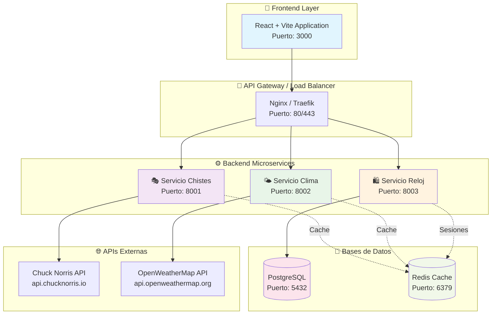
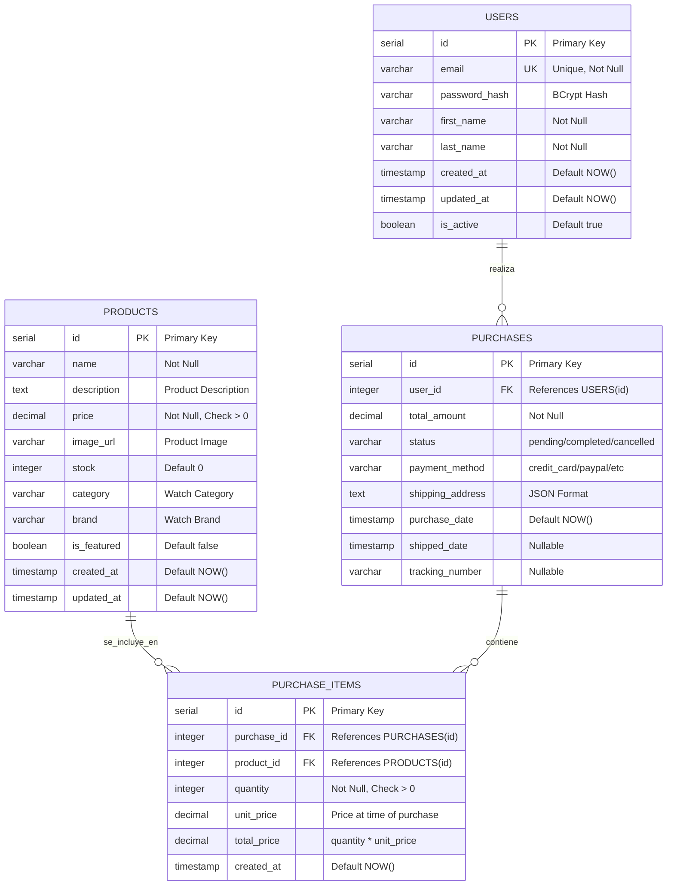
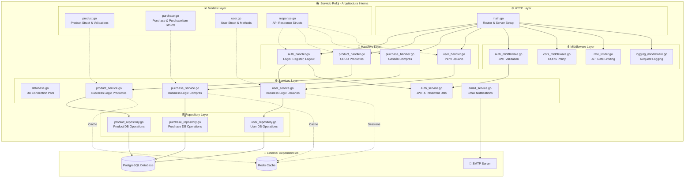
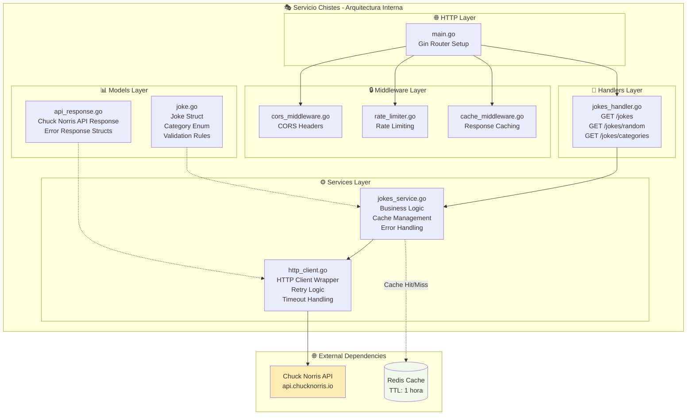
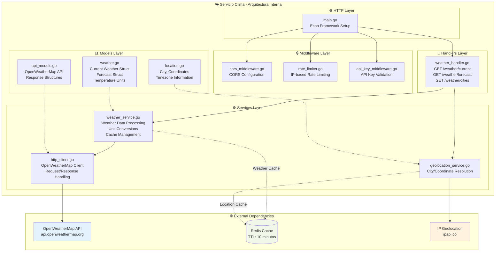

# 🏍️ MotoStorm-Jokes - Documentación de Arquitectura

## 📋 Tabla de Contenido

1. [Resumen Ejecutivo](#resumen-ejecutivo)
2. [Arquitectura del Sistema](#arquitectura-del-sistema)
3. [Base de Datos - Servicio Reloj](#base-de-datos---servicio-reloj)
4. [Componentes de Microservicios](#componentes-de-microservicios)
   - [Servicio Reloj (Tienda)](#servicio-reloj-tienda)
   - [Servicio Chistes](#servicio-chistes)
   - [Servicio Clima](#servicio-clima)
5. [Tecnologías Utilizadas](#tecnologías-utilizadas)
6. [APIs y Servicios Externos](#apis-y-servicios-externos)

---

## 🎯 Resumen Ejecutivo

MotoStorm-Jokes es una aplicación web moderna construida con arquitectura de microservicios que combina entretenimiento y funcionalidad. La plataforma ofrece una experiencia integral que incluye:

- **🎭 Sistema de Chistes**: Integración con Chuck Norris API para contenido humorístico
- **🌤️ Información Meteorológica**: Datos climáticos en tiempo real
- **🛍️ Tienda de Relojes**: Sistema completo de e-commerce con autenticación y gestión de compras

---

## 🏗️ Arquitectura del Sistema

La arquitectura sigue el patrón de microservicios con separación clara de responsabilidades:



---

## 🗄️ Base de Datos - Servicio Reloj

### Diagrama Entidad-Relación



### Índices Recomendados

```sql
-- Índices para optimización de consultas
CREATE INDEX idx_users_email ON USERS(email);
CREATE INDEX idx_products_category ON PRODUCTS(category);
CREATE INDEX idx_products_price ON PRODUCTS(price);
CREATE INDEX idx_purchases_user_id ON PURCHASES(user_id);
CREATE INDEX idx_purchases_date ON PURCHASES(purchase_date);
CREATE INDEX idx_purchase_items_purchase_id ON PURCHASE_ITEMS(purchase_id);
CREATE INDEX idx_purchase_items_product_id ON PURCHASE_ITEMS(product_id);
```

---

## 🔧 Componentes de Microservicios

### 🛍️ Servicio Reloj (Tienda)



### 🎭 Servicio Chistes



### 🌤️ Servicio Clima



---

## 🛠️ Tecnologías Utilizadas

### Frontend
- **React 18** - Biblioteca de UI con hooks modernos
- **Vite** - Build tool y dev server ultrarrápido
- **TypeScript** - Tipado estático para JavaScript
- **Tailwind CSS** - Framework de CSS utility-first
- **React Router** - Navegación del lado del cliente
- **Axios** - Cliente HTTP para llamadas a APIs

### Backend
- **Go 1.21+** - Lenguaje de programación principal
- **Gin/Echo** - Frameworks web HTTP para Go
- **GORM** - ORM para Go con soporte PostgreSQL
- **JWT-Go** - JSON Web Tokens para autenticación
- **bcrypt** - Hashing de contraseñas
- **go-redis** - Cliente Redis para Go

### Base de Datos y Cache
- **PostgreSQL 14+** - Base de datos relacional principal
- **Redis 7** - Cache en memoria y gestión de sesiones

### DevOps y Deployment
- **Docker** - Containerización de servicios
- **Docker Compose** - Orquestación de contenedores
- **Nginx** - Proxy reverso y load balancer
- **GitHub Actions** - CI/CD pipeline

---

## 🌐 APIs y Servicios Externos

### Chuck Norris API
- **URL Base**: `https://api.chucknorris.io/jokes/`
- **Endpoints Utilizados**:
  - `GET /random` - Chiste aleatorio
  - `GET /categories` - Lista de categorías
  - `GET /random?category={category}` - Chiste por categoría
- **Rate Limit**: Sin límites documentados
- **Autenticación**: No requerida

### OpenWeatherMap API
- **URL Base**: `https://api.openweathermap.org/data/2.5/`
- **Endpoints Utilizados**:
  - `GET /weather` - Clima actual
  - `GET /forecast` - Pronóstico 5 días
  - `GET /geocoding/direct` - Geocodificación
- **Rate Limit**: 60 llamadas/minuto (plan gratuito)
- **Autenticación**: API Key requerida

### Consideraciones de Seguridad
- **API Keys** almacenadas en variables de entorno
- **Rate Limiting** implementado en todos los servicios
- **HTTPS** obligatorio en producción
- **CORS** configurado restrictivamente
- **JWT Tokens** con expiración corta (15 minutos)
- **Refresh Tokens** para renovación automática

---

## 📈 Métricas y Monitoreo

### Health Checks
Cada servicio expone un endpoint `/health` que verifica:
- Conectividad a base de datos
- Disponibilidad de APIs externas
- Estado de cache Redis
- Uso de memoria y CPU

### Logging
- **Formato**: JSON estructurado
- **Niveles**: ERROR, WARN, INFO, DEBUG
- **Correlación**: Request ID para trazabilidad
- **Agregación**: ELK Stack (Elasticsearch, Logstash, Kibana)

---

*Última actualización: Septiembre 2025*